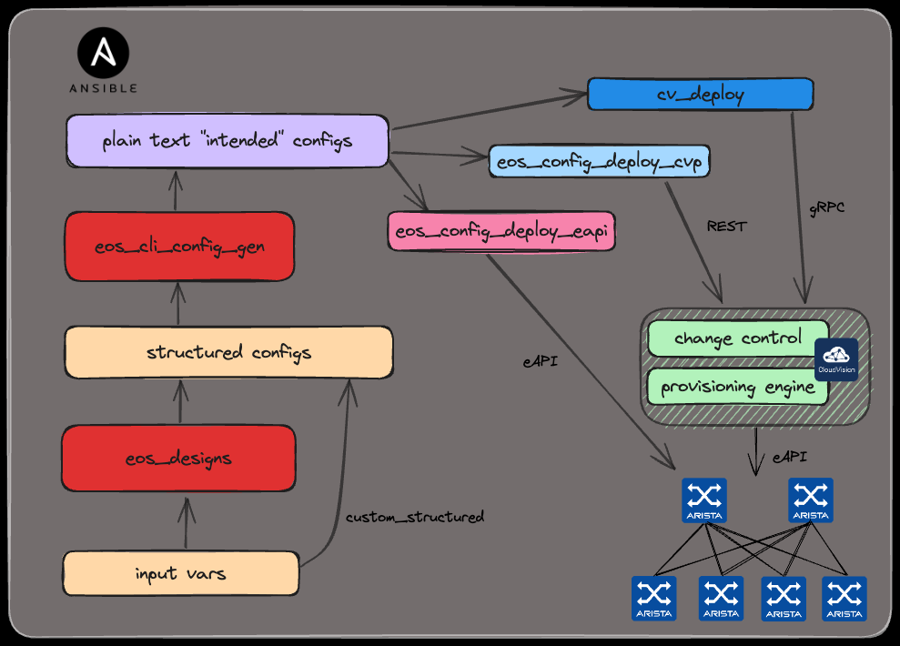
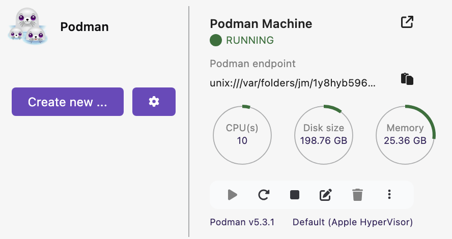
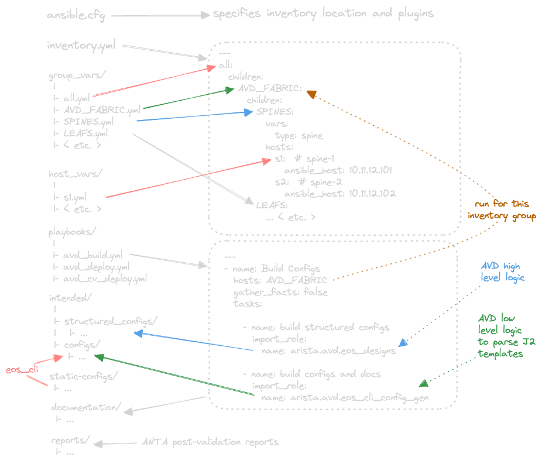

# AVD Slow Cooking

<style scoped>section {font-size: 26px;}</style>

101 session with tasty recipes 🔪 :cut_of_meat: :carrot:

<!-- Do not add page number on this slide -->
<!--
_paginate: false
-->


```sh
$ whoami
# Petr Ankudinov, Senior Solutions Engineer
pa #@arista.com
$ date +"%b %Y"                 
Mar 2025
```

<!-- Add footer starting from this slide -->
<!--
footer: ''
-->

---

# Agenda

- What is AVD
- Environment
- How to structure your inventory
- Life quality improvements


---

# What is AVD



<style scoped>section {font-size: 18px;}</style>

- [AVD is an open-source project](https://avd.arista.com)
- AVD stands for "Architect, Validate, and Deploy"
- [Supported designs](https://avd.arista.com/5.2/ansible_collections/arista/avd/roles/eos_designs/index.html) as of AVD 5.2:
  - L3LS EVPN / L2LS / MPLS / Campus
  - WAN AutoVPN/CV Pathfinder
- Roles:
  - `arista.avd.eos_designs` - abstracted to low level variables
  - `arista.avd.cli_config_gen` - parse templates to build plain text configs
  - `arista.avd.cv_deploy` - push configurations to Arista CloudVision Portal (replaced `eos_config_deploy_cvp`)
  - `arista.avd.eos_config_deploy_eapi` - push configs to switches directly. Based on [`arista.eos.eos_config`](https://docs.ansible.com/ansible/latest/collections/arista/eos/eos_config_module.html). [`arista.eos`](https://galaxy.ansible.com/arista/eos) is maintained by RedHat ⚠️
  - `arista.avd.eos_validate_state` - validate operational state of Arista EOS devices (with ANTA)

---

# Open Source: What to Expect

<style scoped>section {font-size: 18px;}</style>


- Pros:
  - free to use
  - very agile and active community can outperform every alternative
  - open to any [feedback](https://github.com/aristanetworks/avd/discussions), [bug reports and feature requests](https://github.com/aristanetworks/avd/issues)
- Cons:
  - no direct revenue
    - no ads and sponsor buttons in AVD 🤑
    - core contibutors are working for Arista
  - best effort support by default
    - everything can be done - but it's not polite to ask when
    - customers have an option to <ins>buy Arista TAC support for AVD</ins> or Arista PS
- Help the community:
  - be part of the community - contribute ❗
  - understand the rules of the game
  - <ins>buy AVD support</ins> when you can or have higher requirements

---

# Short AVD Workflow Demo

<style scoped>section {font-size: 20px;}</style>


<!--  -->
<iframe width="840" height="472" src="https://www.youtube.com/embed/1J6LbFpt_Qs?si=5PVplVjcG12aMpZV" title="Short AVD Demo" frameborder="0" allow="accelerometer; autoplay; clipboard-write; encrypted-media; gyroscope; picture-in-picture; web-share" referrerpolicy="strict-origin-when-cross-origin" allowfullscreen></iframe>

[Click here to access the demo](https://arista-netdevops-community.github.io/one-click-se-demos/cvaas-cvaas-and-avd-demo--evpn-mlag/cvaas-cvaas-and-avd-demo--evpn-mlag/)

---

# Tools and Prerequsites

<!--  -->


- Check [ATD automation workshop](https://labguides.testdrive.arista.com/2024.3/automation/overview/)
- Git / GitHub
  - check [git-scm book](https://git-scm.com/book/en/v2)
  - [GitHub Git cheatsheet](https://education.github.com/git-cheat-sheet-education.pdf)
- [VSCode](https://code.visualstudio.com/docs)
- Containers
  - [container.training](https://container.training/) can be a good start

---

# AVD Installation Options

<style scoped>section {font-size: 24px;}</style>

<div class="columns">
<div>

- Ansible CE (Community Edition)
  - free to use
  - check [AVD docs](https://avd.arista.com/) for the installation manual
- Ansible Automation Platform
  - paid RedHat support
  - check [AAP guide here](https://avd.arista.com/devel/docs/getting-started/avd-aap.html)
  - out of scope

</div>
<div>

After 4.9 (PyAVD is the foundation ⚠️)

```bash
# ansible-core will be installed as PyAVD requirement
pip install "pyavd[ansible]"
ansible-galaxy collection install arista.avd
# install community.general to support callback plugins, etc.
ansible-galaxy collection install community.general
```

- ⚠️ [PyAVD](https://pypi.org/project/pyavd/) is not intended to be used directly for customer projects
- If you have [an exception](https://github.com/arista-netdevops-community/CloudVisionPortal-Examples/tree/master/pyavd_examples) - this workshop is not for you. You know what to do 🤓 or have Arista PS support
- Ansible provides a lot of value, for ex. inventory management - use Ansible ⚠️

</div>
</div>

---

# How to Cook AVD Inventory

<style scoped>section {font-size: 22px;}</style>


- Be structured.
- Craft your environment and confirm that it works with some basic test.
- Create a minimalistic inventory and generate first configs.
- Grow your environment slowly, keep it clean and easy to read. Avoid workarounds.
- When required - step back to the last working setup
- Iterate
- Cloning existing repo and adjusting to the new setup is not always a good idea.
  - Make sure that you understand every single knob in the cloned inventory

---

# AVD Repository Building Blocks

<style scoped>section {font-size: 20px;}</style>


- Environment
- ansible.cfg
- inventory
- variables
- playbooks
- life quality improvements
  - shortcuts
  - useful hacks

---

`Step 1`

# Environment


---

# Keep Your AVD Environment Clean

<style scoped>section {font-size: 24px;}</style>

<!-- Do not add page number on this slide -->
<!--
class: default
-->


- ⛔ NEVER use "handcrafted" installation direclty on your machine. [It will break](https://xkcd.com/1987/)! Troubleshooting that is wasted time. ⏱️ → 🗑️
- ⛔ NEVER use root account!
- Feasible options:
  - Dedicated and well maintained VM
  - Virtual environment
  - Containers
    - AVD container images are in preview: fully functional, but breaking changes can happen any time
    - No Arista TAC support possible for customers who ordered AVD support
  - AnsibleEEs
    - This one is for RedHat support 💵

---

# Virtual Environment vs Containers

<!-- Do not add page number on this slide -->
<!--
class: invert
-->

<style scoped>section {font-size: 22px;}</style>

<div class="columns">
<div>

venv/pyenv 📦

- Pro:
  - simple and lightweight
  - no special tools required
- Breaks **often**. Troubleshooting complexity: **average**
- How it breaks:
  - multiple Pythons
  - incorrect requirements installation
  - broken path, custom ansible.cfg, tweaks, etc.
  - `../../../<ansible-collection>` 🤦 🙈

</div>
<div>

Containers 🐳

- Pro:
  - stable, portable
  - high level of isolation
- Breaks **rarely**. Troubleshooting complexity: **high**
- How it breaks:
  - permission issues 👑
    - check [this document](https://code.visualstudio.com/remote/advancedcontainers/add-nonroot-user) to UID requirements
  - broken Docker installation or host OS
  - tools can be "too heavy" for some users 🔨

</div>
</div>

---

# AVD Lab Environment: Options

<style scoped>section {font-size: 24px;}</style>


- Linux
  - Docker CE
  - [Install directly](https://avd.arista.com/5.2/docs/installation/collection-installation.html)

    ```bash
    pip install "pyavd[ansible]"
    ansible-galaxy collection install arista.avd
    ```

- Windows
  - WSL2 + Docker CE
- MacOS
  - Podman

⚠️ Use a well maintained and healthy machine!

---

# Linux: Install Docker CE

<style scoped>section {font-size: 24px;}</style>

<div class="columns">
<div>

> The install process was tested on Ubuntu LTS

1. Install Docker on the host. You can used one-liner script for that. [Check Docker documentation](https://docs.docker.com/engine/install/ubuntu/) for details.
2. Add your user to the `docker` group.
3. Logout and login again to apply the changes.
4. Check the Docker version and run hello-world container to test functionality.
5. You must be able to run docker commands without sudo if the installation was succesful.

</div>
<div>

```bash
# install Docker
sudo curl -fsSL https://get.docker.com | sh
# add user to the docker group
sudo usermod -aG docker ${USER}
# test docker
docker --version
docker run hello-world
```


</div>
</div>

---

# Windows: Install WSL2 + 

- Install WSL2
  - Check if default Ubuntu distribution is installed
  - Windows will ask to restart the PC 😉
- Install VSCode if not yet installed
- Install remote development extension on VSCode: `ms-vscode-remote.vscode-remote-extensionpack`
- On the first run VSCode will suggest to install Docker in WSL - accept

> You can install Docker CE on WSL2 machine directly, but VSCode is a better option

---

# MacOS: Install  Desktop

- Check [installation docs](https://podman-desktop.io/docs/installation)
- [Download Podman Desktop here](https://podman-desktop.io/downloads)
  - Alternative option - [Homebrew](https://formulae.brew.sh/formula/podman)
- Once Podman Desktop is installed - create Podman machine
  - <mark><ins>__rootful Podman machine❗__</ins></mark> preferred for a lab
- Check `podman run hello`
- Set `alias docker=podman`
  - future slides will be referring to `docker` assuming this alias



---

# Start AVD Environment in CLI

<style scoped>section {font-size: 18px;}</style>


- Check [available AVD images](https://github.com/aristanetworks/avd/pkgs/container/avd%2Funiversal)
- Set alias:

  ```bash
  # use ~/.bashrc if ZSH is not installed
  echo 'alias avd="docker run --rm -it -v avd-playground:/home/avd/playground -w /home/avd/playground ghcr.io/aristanetworks/avd/universal:python3.11-avd-v5.2.3"' >> ~/.zshrc
  ```

- Start AVD container in interactive mode:

  ```bash
  avd
  ```

- Check installed Ansible collections:

  ```bash
  avd ➜ ~ $ ansible-galaxy collection list | grep avd
  # /home/avd/.ansible/collections/ansible_collections
  arista.avd        5.2.3
  ```

- You can exit container any time with `exit` command

> ⚠️ To start fresh delete the volume: `docker volume rm avd-playground`

---

# Create AVD Environment in VSCode

<style scoped>section {font-size: 18px;}</style>


- To simplify your life open AVD environment in a [dev container using VSCode](https://code.visualstudio.com/docs/devcontainers/containers)
- Use the following snippet in your terminal:

```bash
# create devcontainer.json
mkdir -p avd-playground/.devcontainer
cat <<EOF > avd-playground/.devcontainer/devcontainer.json
{
    "image": "ghcr.io/aristanetworks/avd/universal:python3.11-avd-v5.2.3",
    "remoteUser": "avd",
    "onCreateCommand": "mkdir -p /home/avd/playground",
    "workspaceFolder": "/home/avd/playground",
    "workspaceMount": "source=avd-playground,target=/home/avd/playground,type=volume"
}
EOF
# start the AVD environment in VSCode
cd avd-playground
code .
```

- Click `Reopen in Container` button or use VSCode command pallete to find `Dev Container: Reopen in Container`

> 💡 if `code .` not working, open [VSCode command pallete](https://code.visualstudio.com/docs/getstarted/userinterface#_command-palette) and find and use "Install `code` command in the PATH"

---

# Makefile

<style scoped>section {font-size: 24px;}</style>

- If you need a deeper dive into Makefile syntax and use case - the [makefiletutorial.com](https://makefiletutorial.com/) is the best place to start. You'll be an expert in making Makefiles when you finish. :sunglasses:
- Originally Makefiles were used by C/C++ developers to compile the code.
- Makefiles have a few advantages that make them useful for other use cases:
  - They are simple.
  - They allow assigning a simple shortcut to complex actions.
  - They are available by default on most Linux distributions.
- We are going to use Makefile to create shortcuts to simplify some operations.
- Get Makefile for this workshop now:

```bash
wget https://raw.githubusercontent.com/ankudinov/avd-slow-cooking/refs/heads/master/tools/Makefile
```

---

# Install AVD Examples

<style scoped>section {font-size: 24px;}</style>


- AVD collection has number of build-in and [well documented](https://avd.arista.com/5.2/ansible_collections/arista/avd/examples/single-dc-l3ls/index.html) examples
- This is the best way to start playing with AVD any time and anywhere
- We'll start with "Single DC L3LS" example
- Copy the example inventory files to your container workspace:

  ```bash
  # you can use `make example-l3ls-install` instead
  avd ➜ ~ $ cp -r /home/avd/.ansible/collections/ansible_collections/arista/avd/examples/single-dc-l3ls/* .
  avd ➜ ~ $ ls
  README.md  ansible.cfg  build.yml  deploy-cvp.yml  deploy.yml  documentation  group_vars  images  intended  inventory.yml  switch-basic-configurations
  ```

- You can also use `ansible-playbook arista.avd.install_examples`, but `cp` is faster and more straighforward when you know AVD install path

> 💡 You can use this approach in any non-containerized and working AVD environment to get start experimenting quickly. However make sure that your enviroment fits the inventory ansible.cfg, etc.

---

# Environment Troubleshooting Cheatsheet

<style scoped>section {font-size: 24px;}</style>

<div class="columns">
<div>

- PyAVD is critical in latest AVD versions

  ```bash
  pip freeze | grep pyavd
  ```

- You can encounter Ansible "world writable directory" error in CI, remote containers, etc. due to very relaxed permissions and [Ansible thinking it's not secure](https://docs.ansible.com/ansible/latest/reference_appendices/config.html#avoiding-security-risks-with-ansible-cfg-in-the-current-directory). Fix:

  ```bash
  $ printenv | grep ANSIBLE
  ANSIBLE_CONFIG=ansible.cfg
  ```

- Confirm that your environment is not isolated

  ```bash
  curl --user <login>:<password> --data "show version"
  --insecure https://<switch-mgmt-ip>:443/command-api --verbose
  ```

</div>
<div>

```bash
# Ansible collection setup
ansible --version
# check collections versions and install location
ansible-galaxy collection list
which ansible
# requirements
pip3 freeze
python3.XX -m pip freeze # may not be the same
# and where to find them
pip --version
python3 -c "import ansible as _; print(_.__file__)"
# python
python3 --version
which python
which python3
which python3.XX
python3.11 -c "import sys;print(sys.path)"
# user
whoami
id -u
id -g
echo ${HOME}
# check the PATH
echo ${PATH}
```

</div>
</div>

---

`Step 2`

# ansible.cfg and Inventory


---

# Keep Your `ansible.cfg` Small

```text
[defaults]
inventory = inventory.yml
jinja2_extensions =  jinja2.ext.loopcontrols,jinja2.ext.do,jinja2.ext.i18n
```

> WARNING: If you need longer ansible.cfg - your environment is likely suboptimal.

- Avoid custom collection path, etc. when you don't need it.
- Avoid any kind of relative path, like `../..`
- Test your installation and .cfg on different machines and make sure it works.

---

# Inventory Structure

<style scoped>section {font-size: 17px;}</style>



- Keep inventory structured and readable
  - `all` -> group -> subgroup -> hosts
  - Avoid too many groups. Add if required to structure variables
- Avoid vars in the inventory
  - some short and widely shared setings, like switch type can be part of the inventory
- When lost in your inventory vars:

  ```bash
  ansible-inventory --list
  ansible-inventory --list --yaml
  ansible-inventory --host <host>
  ```

- [Parent/child groups](https://docs.ansible.com/ansible/latest/inventory_guide/intro_inventory.html#grouping-groups-parent-child-group-relationships) to improve the var structure

  ```yaml
  AVD_FABRIC_ENDPOINTS:
      children:
        AVD_FABRIC_LEAFS:
  ```

---

# AVD Inventory Graph

<div class="columns">
<div>

- It's increadibly important to understand the structure of you inventory
- Plan it well
- Visualize with `--graph` when lost
- Get relevant vars with:
 `ansible-inventory --host <host>`

</div>
<div>

```d
$ ansible-inventory --graph
@all:
  |--@ungrouped:
  |--@AVD_FABRIC:
  |  |--@AVD_FABRIC_SPINES:
  |  |  |--s01
  |  |  |--s02
  |  |--@AVD_FABRIC_LEAFS:
  |  |  |--@pod0:
  |  |  |  |--l01
  |  |  |  |--l02
```

</div>
</div>

---

# Git Init Your Inventory

<style scoped>section {font-size: 22px;}</style>


- Use VSCode [source control](https://code.visualstudio.com/docs/sourcecontrol/overview) to git init your inventory
- You can use CLI instead:

```bash
# configure user.name and email if not yet set
git config user.email "avd@lab.net"
git config user.name "AVD lab user"
# git init your repo, add and commit all files
git init
git add .gitignore
git add *
git commit -m "init"
```

- You can now use `git diff` or VSCode source control to inspect the changes
- Commit your changes any time with `git commit -m "<any-message>"`

---

# JSON and YAML Query

<div class="columns">
<div>

- `jq` is a lightweight and flexible command-line JSON processor
- Often installed by default
- Example:

  ```bash
  echo '{"fruit": "Apple","size": "Large","color": "Red"}' | jq ".fruit"
  ```

- Check the [docs](https://jqlang.org/)

</div>
<div>

- `yq` - similar to `jq`, but supports YAML
- Install with: `make install-yq`
- Example:

  ```bash
  cat inventory.yml | yq '.. | select(key=="DC1_SPINES")'
  ```

- Check the [docs](https://mikefarah.gitbook.io/yq)

</div>
</div>

---

# Hands-on: Remove Some Groups

<style scoped>section {font-size: 16px;}</style>


```bash
yq -i '.all.children.FABRIC.children.DC1.children.DC1_SPINES.vars.type = "spine"' inventory.yml
yq -i '.all.children.FABRIC.children.DC1.children.DC1_L3_LEAVES.vars.type = "l3leaf"' inventory.yml
yq -i '.all.children.FABRIC.children.DC1.children.DC1_L2_LEAVES.vars.type = "l2leaf"' inventory.yml
rm group_vars/DC1_SPINES.yml
rm group_vars/DC1_L3_LEAVES.yml
rm group_vars/DC1_L2_LEAVES.yml
```

- You can use `make example-rm-groups` shortcut for that.

> Verify you inventory and check `printenv | grep ANSIBLE`.

---

`Step 3`

# Variables


---

# Quote All The Strings

<style scoped>section {font-size: 18px;}</style>

<div class="columns">
<div>

- A wisdom from the unknown source:
  > Experienced YAML users quote all the strings.
- YAML is flexible and not forcing you to quote strings. But that is often causing weird problems.
- If not certain, quote the string!
- That is especially important when working with Ansible. As Ansible has it's own way of interpreting certain YAML values.
- Use following to verify your YAML:

  ```bash
  yq --prettyPrint -o=json <name-of-your-yaml-file>
  ```

</div>
<div>

Is this YAML correct?

```yaml
port_channel:
  mode: on
```

It is. But it will break Ansible playbook execution as `on` and `yes` are converted to `True` by Ansible.

```text
ERROR! [leaf1]: 'Validation Error: servers[0].adapters[0].port_channel.mode': True is not of type 'str'
ERROR! [leaf1]: 'Validation Error: servers[0].adapters[0].port_channel.mode': 'True' is not one of ['active', 'passive', 'on']
```

Fun with YAML

```yaml
string: "just a string"
integer: 1234
and_that_is_an_integer_too: 0xABCD
float: 12.34
version: "1.0" # is a string
boolean: true
# that's super weird, don't do that
but_that_is_a_string: !!str True
# there is a special `null` value for this case
and_this_is_not_empty:
a_better_null: ~
```

</div>
</div>

---

# Ansible Inventory is Machine-Readable

<style scoped>section {font-size: 20px;}</style>
<style scoped>code {font-size: 20px;}</style>

<div class="columns">
<div>

- YAML is not plain text
- Everything that is coded as YAML, can be converted into JSON, replaced with JSON or any other machine readable data source
- Data can be processed by a number of tools:
  - Ansible
  - jq
  - yq
  - Python scripts
  - etc.
- Useful commands:
  - `ansible-inventory --list`
  - `ansible-inventory --list --yaml`
  - `ansible-inventory --host <hostname>`

</div>
<div>

```bash
$ ansible-inventory --host dc1-leaf1a | jq ".. | .svis? | select(.)"
-vvvv to see details
[
  {
    "enabled": true,
    "id": 11,
    "ip_address_virtual": "10.10.11.1/24",
    "name": "VRF10_VLAN11"
  },
  {
    "enabled": true,
    "id": 12,
    "ip_address_virtual": "10.10.12.1/24",
    "name": "VRF10_VLAN12"
  }
]
[
  {
    "enabled": true,
    "id": 21,
    "ip_address_virtual": "10.10.21.1/24",
    "name": "VRF11_VLAN21"
  },
  {
    "enabled": true,
    "id": 22,
    "ip_address_virtual": "10.10.22.1/24",
    "name": "VRF11_VLAN22"
  }
]
...
```

</div>
</div>

---

# Vars Structure

<style scoped>section {font-size: 18px;}</style>


- Structure group vars in a meaningful way
- Example

  ```bash
  all # <- Empty or general Ansible settings
  |- CV_SERVERS # <- Cloudvision/Terminattr settings
  |- AVD_FABRIC # <- "Fabric" wide settings
     |- LOCATION_A
     |- LOCATION_A_MGMT
     |... # other locations
     |- LOCATION_A_TENANTS
     |- LOCATION_A_ENDPOINTS # usually a directory
  ```

- Be careful with hostvars as `eos_designs` has full control over structured configs
  - Use `custom_structured` to override

---

# Working with Big Data Structures in AVD

- Some data structures in AVD can be huge. Best example is port provisioning `servers:` can grow really fast in production.
- YAML with let's say 20K lines is not very human friendly.
- To simplify provisioning new servers, you can:
  - Split the port provisioning YAML into multiple files
  - Use some helper script/tools to work with complex data structures

---

# How to Split AVD Servers into Multiple Files

<style scoped>section {font-size: 14px;}</style>

- Ansible allows splitting group vars into multiple files. For example ATD_SERVERS group vars could be a directory:

```text
AVD_ENDPOINTS
|- main.yml
|- leaf_endpoints.yml
|- mgmt_endpoints.yml
# ... etc
```

- The problem with this approach is that when Ansible will encounter the same key in different YAMLs, it will overwrite the value. That means if `server:` is defined everywhere only the last occurrence wins.
- AVD allows to define [`connected_endpoints_keys:`](https://avd.arista.com/4.10/roles/eos_designs/docs/input-variables.html?h=connected_endpoints_keys#connected-endpoints-keys-settings) that can be used to solve the problem above.
- Split is ofter per-MLAG

```yaml
---
connected_endpoints_keys:
  - key: servers
    type: server
  - key: leaf_endpoints
    type: server
  - key: mgmt_endpoints
    type: server
```

```yaml
---
leaf_endpoints:
  - name: l01_l02_e1
# ... etc
```

---

# Hands-on: Change Connected Endpoints

<style scoped>section {font-size: 20px;}</style>


```bash
mkdir group_vars/CONNECTED_ENDPOINTS
cat <<EOF > group_vars/CONNECTED_ENDPOINTS/main.yml
---
connected_endpoints_keys:
  - key: servers
    type: server
  - key: dc1-leaf1-endpoints
    type: server
  - key: dc1-leaf2-endpoints
    type: server
EOF
yq eval 'del(.servers[] | select(.name == "dc1-leaf2-server1"))' group_vars/CONNECTED_ENDPOINTS.yml > group_vars/CONNECTED_ENDPOINTS/dc1-leaf1-endpoints.yml
yq -i '.dc1-leaf1-endpoints = .servers | del(.servers)' group_vars/CONNECTED_ENDPOINTS/dc1-leaf1-endpoints.yml
yq eval 'del(.servers[] | select(.name == "dc1-leaf1-server1"))' group_vars/CONNECTED_ENDPOINTS.yml > group_vars/CONNECTED_ENDPOINTS/dc1-leaf2-endpoints.yml
yq -i '.dc1-leaf2-endpoints = .servers | del(.servers)' group_vars/CONNECTED_ENDPOINTS/dc1-leaf2-endpoints.yml
rm group_vars/CONNECTED_ENDPOINTS.yml
```

---

`Step 4`

# Playbooks


---

# Ansible Playbook

<style scoped>section {font-size: 20px;}</style>
<style scoped>code {font-size: 20px;}</style>

<div class="columns">
<div>

- Ansible playbook is a YAML file that defines a set of tasks to be executed on a set of hosts.
- A playbook consists of one or more `plays`.
- Every play consists of one or more `tasks` using specific `modules` with or without parameters.
- Example playbook uses following modules:
  - [arista.eos](https://github.com/ansible-collections/arista.eos)
  - [arista.eos.eos_banner](https://github.com/ansible-collections/arista.eos/blob/main/plugins/modules/eos_banner.py)

</div>
<div>

```yaml
---
# a playbook to configure banner on EOS switches
- name: Configure banner on EOS switches  # <-- Play
  hosts: ATD_FABRIC  # <-- Target hosts
  tasks:
    - name: Gather facts  # <-- Task
      arista.eos.eos_facts:  # <-- Module
        gather_subset: all  # <-- Module parameter
      register: facts
    - name: Check facts output
      debug:
        msg: "{{ facts }}"
    - name: Configure login banner
      arista.eos.eos_banner:
        banner: motd
        text: |
          "{{ banner_text }}"
        state: present
```

</div>
</div>

---

# Ansible Playbook Arguments

<style scoped>section {font-size: 18px;}</style>

- `ansible-playbook` command has number of useful arguments that can be used to control the execution.
- We'll highlight few of them:
  - `--check` - run the playbook in check mode. No changes will be applied.
  - `--diff` - show the diff of the changes that will be applied.
  - `--limit` - limit the execution to specific hosts or groups.
  - `--tags` - limit the execution to the tasks with specific tags
    - AVD is [removing tags support in 5.0](https://avd.arista.com/devel/docs/porting-guides/5.x.x.html#removal-ansible-tags-from-avd-roles) ❗
    - Ansible [playbook tags](https://docs.ansible.com/ansible/latest/playbook_guide/playbooks_tags.html) are not extremely useful as well
  - `--forks` - limit the number of parallel tasks, default is 5.
  - `--verbose` - increase the verbosity level. Up to -vvvvvv. Helps to troubleshoot the playbook execution. But not a lot. 🥹
- Example:

  ```bash
  ansible-playbook playbooks/deploy_banner.yml --check --diff --limit leaf1 -vvv
  ```

---

# What Playbooks Do You Need

<style scoped>section {font-size: 18px;}</style>


- Don't be shy to create multiple playbooks to cover different use cases
- Examples:
  - Build configs. It's a great idea to keep it separate from deploy!
  - Build configs for specific network location. For example, single DC in a multi-DC network
  - Deploy configs using CVP/CVaaS
  - Deploy configs using eAPI
  - ANTA tests

---

# Troubleshooting AVD Inventory

<style scoped>section {font-size: 22px;}</style>


- If your 10'000 lines inventory breaks - cut the last 5000 you just added
- Never have hundreds of uncommitted files
- Don't work as root! NEVER!
- Always check and understand your environment
- When things break:
  - open TAC case if you ordered AVD support (order now 🛒)
  -OR-
  - create an issue on Github after initial troubleshooting

---

# eos_cli

<style scoped>section {font-size: 18px;}</style>

- There is nothing wrong in using `eos_cli` for certain cases.
- But:
  - keep it limited
  - make your life easier by not coding plain text in YAML

  ```yaml
  # reconcile static configs
  static_config_filename: "/workspaces/avd_inventory/static-configs/{{ inventory_hostname }}.txt"
  eos_cli: "{{ lookup('ansible.builtin.file', static_config_filename) }}"
  ```

- Same considerations valid for `custom_structured_configuration_`. The most weird field example I've seen is starting breakout configuration from /4 🤦:

  ```yaml
  custom_structured_configuration_ethernet_interfaces:
    - name: Ethernet12/1
      speed: forced 25gfull
  ```

- However if you need a lot of `eos_cli` or `custom_structured_configuration_` tweaks in your inventory - something is **WRONG**!

---

# Q&A


- [Ansible AVD](https://avd.arista.com/)
- [This repository](https://github.com/ankudinov/avd-slow-cooking)

```diff
- One more slide!
+ No more slides.
```

```bash
git commit -m "The END!"
```

<!-- Add footer starting from this slide -->
<!--
footer: ''
-->
